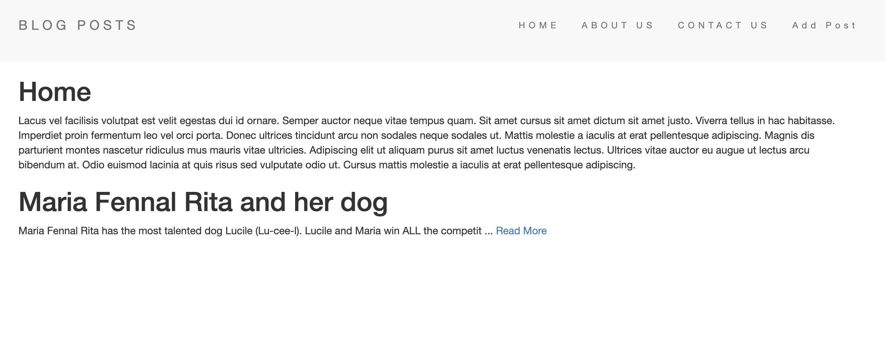
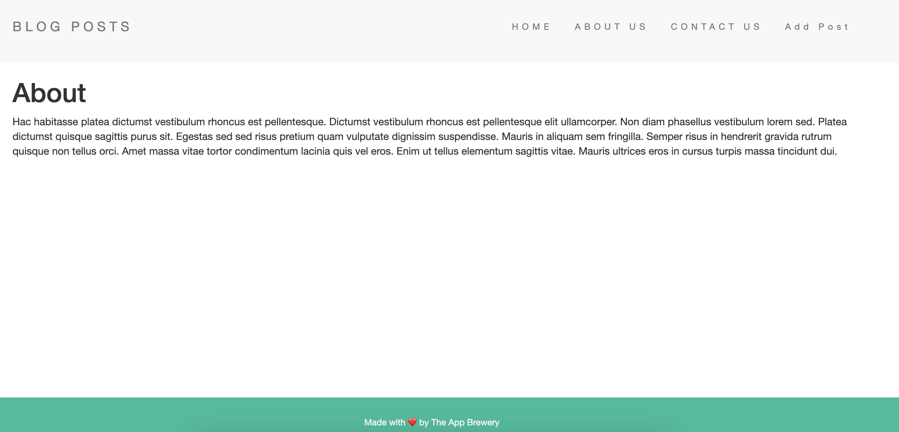
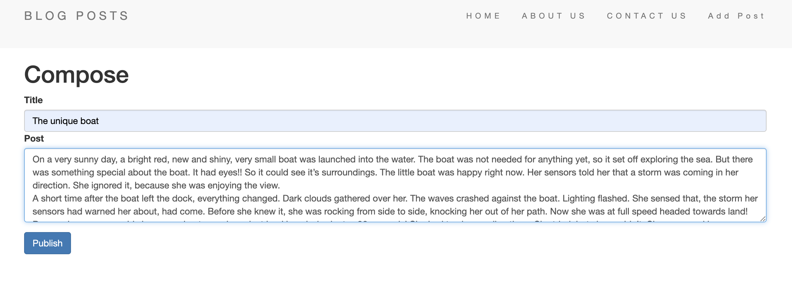
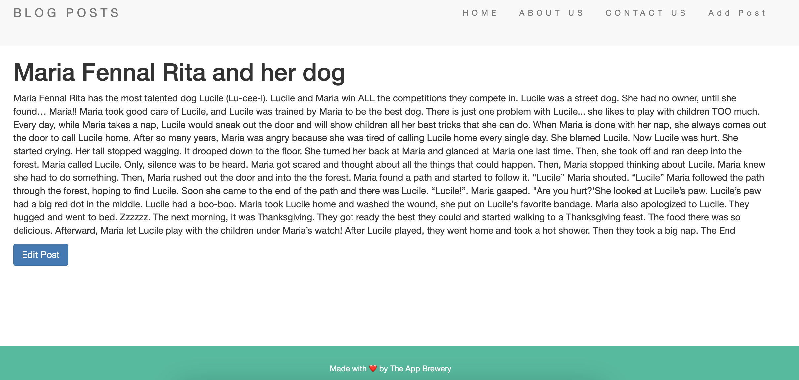
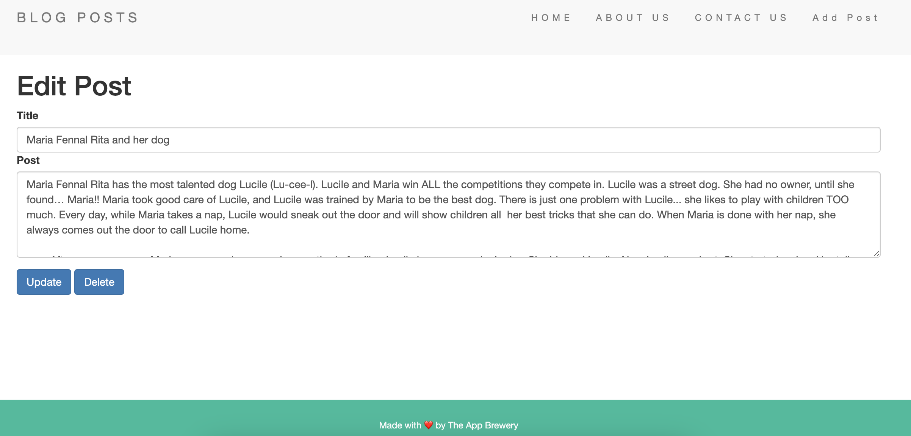

<h1>About</h1>

<b>Blog wiki</b> is an app where you can create/edit/delete a blog post to a mongo database. Also have different navigation tabs (Home, About, Contact, Add Post) to navigate around easily. 

<b>CSS, HTML, Javascript, EJS, Express, Mongoose</b>

<h1>Look and Feel</h1>

<h3>Home page </h3> 
Shows all posts stored in database, and content of each post truncated to fixed characters.

<h3>About/ Contact </h3> 
Both tabs have similar views, displaying static content.

<h3>Add Post</h3> 
Create a new post by clicking on Add Post tab

<h3>Read more...</h3> 
Click on 'Read more' for any post to see its full content

<h3>Edit/ Delete.</h3> 
On each post with full content view, there is Edit button to facilitate update/delete of particular post. 

